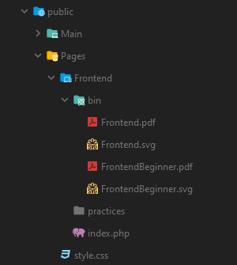
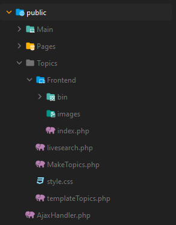
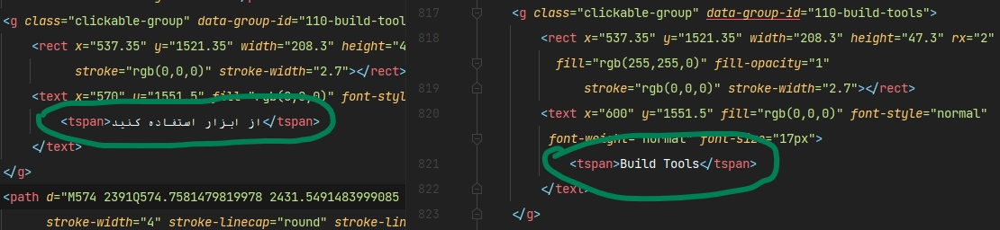
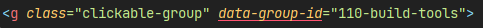
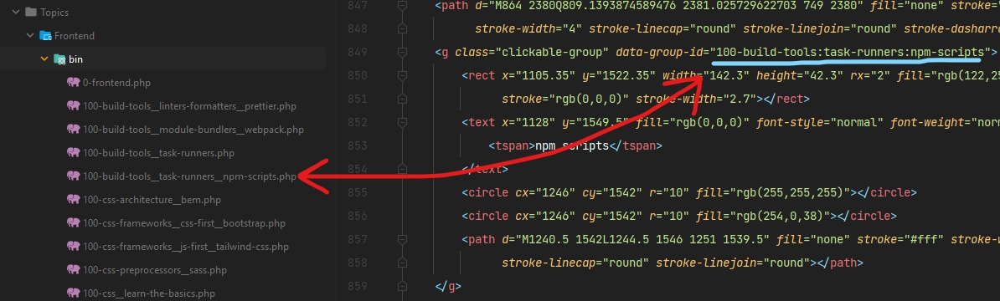

# Documentation

## پوشه بندی 

- assets (فایل های استایل)
  + css (استایل های اصلی)
  + fonts (تمام فونت ها)
  + img (عکس های اصلی)
  + js (فانکشن های پر استفاده)
  + vendor (کتابخوانه ها و هلپر ها)
- public (تمام صفحات)
  + 30Days (صفحات اصلی نقشه راه 30 روزه)
    + NameRoadMap (اسم نقشه راه)
      + assets (فایل های مورد نیاز هر نقشه راه - زبان کدها)
      + img (عکس های مورد نیاز)
      + index.php (صفحه اصلی نقشه راه)
      + (Day1 - Day30 .php) (صفحات روز 1 تا 30 ام)
    + style.css (استایل برای تمام نقشه راه های 30 روزه)
  + Guides (صفحات راهنما)
    + bin (فایل های راهنما - نیاز به تغییر ندارد)
    + index.php (صفحه اصلی راهنما)
    + style.css (استایل برای تمام راهنما ها)
  + Main (هدر ، فوتر ، متالینک ها)
  + Pages (صفحات اصلی نقشه راه ها)
    + NameRoadMap (اسم نقشه راه)
      + bin (فایل های svg و pdf برای نقشه راه) 
      + practice
      + index.php (صفحه اصلی نقشه راه)
    + style.css (استایل برای تمام نقشه راه ها)
  + Topics (توضیحات بخش های مختلف نقشه راه)
    + NameTopics
      + bin (تمام توضیحات نقشه راه (برای هر نقشه راه جدا))
      + images (عکس های مورد نیاز برای موضوعات)
      + index.php (صفحه اصلی موضوعات برای هر نقشه راه)
    + livesearch.php (فایل آیجکس برای سرچ موضوعات)
    + MakeTopics.php (فایل ایجاد قالب از موضوعات به صورت خودکار)
    + templateTopics.php (قالب آماده برای موضوعات)
    + style.css (استایل برای همه موضوعات)
  + AjaxHandler.php (آیجکس برای باز کردن موضوعات از طریق نقشه راه)
- HelpForContributors (راهنمای توسعه)
- Constants.php (مقادیر اولیه و ثابت سایت)
- index.php (خانه)

## راهنمای توسعه 

- نیازی به تغییر استایل ها ندارید (الزامی در تغییر پوشه assets وجود ندارد)
- نیازی به تغییر کلیات و فانکشن های نوشته شده نیست !
- پوشه public دارای 5 بخش مجزا است
  + پوشه 30Days (نقشه راه های 30 روزه در اینجا تعریف میشوند)
    + پوشه ایی ایجاد کنید به نام نقشه راه مورد نظر (مثال : JavaScript)(میتونید از پوشه JavaScript یک کپی بگیرید و اسم آن را تغییر دهید)
      +  پوشه assets (فایل های مورد نیاز هر نقشه راه 30 روزه - در نقشه راه 30 روزه از prism استفاده میشود برای انتخاب زبان کدنویسی ، فایل FileNeedIt را ویرایش کنید)
      + پوشه img (عکس های مورد نیاز هر نقشه راه)
      + فایل index.php (صفحه اصلی هر نقشه راه 30 روزه)
      + فایل های Day1.php تا Day30.php (هر روز در یک فایل جداگانه به صورت Day + روز ساخته میشود)
    + فایل style.css (این استایل برای تمامی نقشه راه های 30 روزه است)
  + پوشه Guides (راهنمای استفاده از سایت برای بازدید کنندگان در اینجا تعریف میشود)
    +  پوشه bin (هر فایل راهنما به صورت تک فایل در این قسمت قرار میگیره)
    + فایل index.php (صفحه اصلی راهنما - بعد از اضافه کردن راهنما خود این قسمت را هم ویرایش کنید)
    + فایل style.css (استایل برای تمامی راهنما ها)
  + پوشه Main (نیازی به تغییر این بخش نیست)
  + پوشه pages (تمامی نقشه راه ها در اینجا تعریف میشوند)
    + پوشه ایی ایجاد کنید به نام نقشه راه مورد نظر (مثال : Frontend) (میتوانید از پوشه Frontend یک کپی بگیرید و اسم آن را تغییر دهید)
      + پوشه bin (فایل svg و pdf نقشه راه را در اینجا بگذارید (دقیقا با نام نقشه راه (پوشه) یکسان باشد))
      + practices
      + فایل index.php (نیازی به تغییر و ویرایش ندارید ، به طور خودکار svg شما را لود میکند)
    + فایل style.css (این استایل برای تمامی صفحات اصلی نقشه راه است)
  + توضیحات هر نقشه راه (Topics)
    + پوشه ایی ایجاد کنید به نام نقشه مورد نظر (مثال : Frontend) (میتوانید از پوشه Frontend یک کپی بگیرید و اسم آن را تغییر دهید)
      + پوشه bin (موضوعات مختلف هر نقشه راه در این قسمت قرار میگیرد)
      + پوشه images (عکس های مورد نیاز هر یک از فایل های داخل پوشه bin)
      + فایل index.php نیازی به تغییر ندارد و به طور خودکار لود میشود
    + فایل livesearch.php فایلی برای قسمت سرچ میباشد و نیازی به تغییر ندارد
    + فایل MakeTopics.php فایلی برای ایجاد قالب تاپیک ها میباشد (توضیحات مربوط در بخش پایین)
    + فایل style.css استایل همه ی توضیحات میباشد و نیاز به تغییر ندارد
    + فایل templateTopics.php قالب اولیه موضوعات میباشد
  + فایل AjaxHandler.php فایلی برای باز کردن توضیحات در نقشه راه ها میباشد و نیازی به تغییر ندارد
- فایل Constants.php فایل اولیه و ثابت های را شامل میشود
- فایل index.php صفحه خانه است

## 30Day RoadMap

- در پوشه 30Days ، پوشه ایی ایجاد کنید به نام نقشه راه خود (برای مثال : JavaScript) میتوانید از همین پوشه یک کپی بگیرید.
- در پوشه assets فایل های مورد نیاز خود را قرار دهید (فایلی به نام FileNeedIt.js وجود دارد که میتوانید زبان prism (کتابخانه هایلایتر کد) را تغییر دهید)
- پوشه img برای عکس های مورد نیاز نقشه راه است.
- فایل index.php صفحه اصلی نقشه راه شما است
- فایل های Day1.php تا Day30.php نقشه راه روزانه است و برای هر روز یک فایل داریم
- به موارد زیر توجه داشته باشید :
  + نیاز به تغییر توابع و اسکریپت های هدر و انتهایی بدنه ندارید ، فقط متن خود را بنویسید.
  + توجه داشته باشید که کلاس های تگ ها را ویرایش نکنید.
  + تگ section با کلاس list30days لیست ابتدایی را مشخص میکند (href مناسبی برای هر گزینه از لیست انتخاب کنید{href هر لیست باید با id متناسب خود در ارتباط باشد})
  + تگ article برای مقاله اصلی شما است (به تگ های h1 تا h4 توجه کنید {تگ های h به ترتیب ساب لیست ها کم میشوند})
  + برای نوشتن پارگراف تگ p را درون تگ div قرار دهید
  + برای نوشتن دستورات خود (کدها) تگ code را درون تگ pre باز کنید و دستورات خود را بنویسید

## Make SVG

- میتوانید svg آماده را از سایت roadmap.sh تهیه و آن را فارسی کنید (فقط جملات را ترجمه کنید ، نیاز به ویرایش ما بقیه اطلاعات نیست)
- اگر میخواهید خودتان نقشه راه بسازید به موارد زیر دقت کنید
  + فایل svg شما باید کاملا طراحی شده باشد (به صورت image embed نباشد) (به عنوان مثال میتوانید فایل Frontend.svg را مشاهده کنید)
  + حتما بعد از فارسی سازی هر بخش مکان مناسبی برای متن انتخاب کنید (x, y)
  + به قسمت هایی که قابلیت کلیک دارند کلاس clickable-group و همچنین پراپرتی data-group-id میدهید (در نقشه راه تمامی موارد قابل کلیک هستند و تاپیک مورد نظر خود را باز میکنند)
  + پراپرتی data-group-id همان متصل کننده svg شما به تاپیک مورد نظر میباشد
  + به عنوان مثال ("data-group-id="100-desktop-applications:electron) به موضوع desktop applications قسمت electron اشاره میکند
  + بعد از ساخت svg مورد نظر ، در قسمت Topics/YourRoadMaps/bin میتوانید موضوعاتی که در data-group-id انتخاب نمودید را با استفاده از template آماده (templateTopics.php) بسازید
  + حتما در ساخت فایل در پوشه bin ( : ) را تبدیل به ( __ ) کنید (100-desktop-applications:electron > 100-desktop-applications__electron)
- در فایل Constants.php ثابت GET_ALL_TOPICS را برابر 1 قرار دهید و صفحه نقشه راه خود را ریفرش کنید (به طور خودکار تمامیه data-group-id ها به فایل تبدیل میشوند و فقط باید آن ها را ویرایش کنید)
- در فایل Constants.php ثابت CHECK_SVG را برابر 1 قرار دهید و صفحه نقشه راه خود را ریفرش کنید (به طور خودکار تمامیه رنگ ها ویرایش میشوند (اگر از سایت roadmap.sh تهیه نمودید))
- بعد از موارد بالا ثابت ها را بر روی 0 قرار دهید تا بار سرور افزایش پیدا نکند

## Help images

  
 محتویات پوشه pages 

  

  

  
 محتویات پوشه Topics 

  

  

  
 محتویات پوشه Topics/YourRoadMap/bin 

  

  

  
 ترجمه 

  

  

  
 اضافه کردن کلاس و پراپرتی 

  

  

  
 ساخت فایل در پوشه bin با نام data-group-id 

  

